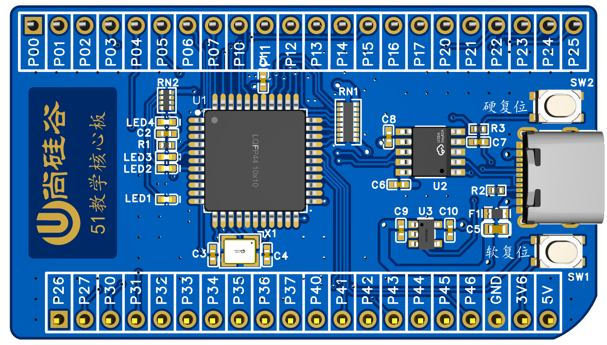
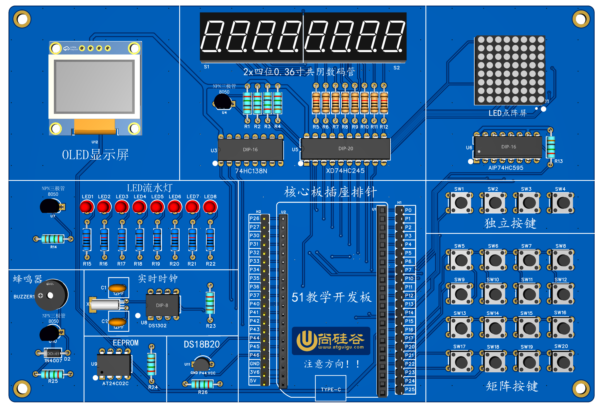

# STC89C52RC 嵌入式开发实践

## Overview

基于 STC89C52RC 教学板的 C51 工程，覆盖 GPIO、显示、按键、定时器、中断、UART、软件 I²C、RTC 和温度传感器。早期实验直接操作端口，后期工程逐步拆分为 Com、Dri、Int 和应用逻辑。

## Architecture

以下为教学核心板与扩展板的结构渲染图，用于定位主要接口和板载器件。

| 教学核心板 V1.0 | 教学扩展板 V1.0 |
| --- | --- |
|  |  |

核心板、扩展板原理图和器件手册位于 [hardware](hardware/README.md)。

按系统查看：[GPIO / 输出](projects/01_LED/) · [数码管](projects/02_数码管/) / [OLED](projects/10_OLED/) · [按键](projects/03_按键/) / [外部中断](projects/05_外部中断/) · [定时器](projects/06_定时器/) / [UART](projects/08_UART/) · [EEPROM](projects/09_I2C与AT24C02/) / [温度](projects/11_DS18B20/) / [RTC](projects/12_DS1302/) · [综合应用](projects/13_环境与时钟信息终端/)

## Technical Highlights

| 模块 | 实现 |
| --- | --- |
| [01 LED](projects/01_LED/) | 单灯、闪烁、流水灯与 P0 低电平输出 |
| [02 数码管](projects/02_数码管/) | 段码、74HC138 位选和动态扫描 |
| [03 按键](projects/03_按键/) | 独立按键消抖与 4×4 矩阵扫描 |
| [04 蜂鸣器](projects/04_蜂鸣器/) | 按键、声音和显示联动 |
| [05 外部中断](projects/05_外部中断/) | P3.2 / INT0 下降沿触发 |
| [06 定时器](projects/06_定时器/) | Timer0 重装、中断计数与回调 |
| [07 点阵](projects/07_点阵/) | 74HC595、逐行扫描和滚动显示 |
| [08 UART](projects/08_UART/) | 单字节命令、多字节接收和中断缓冲 |
| [09 I²C / AT24C02](projects/09_I2C与AT24C02/) | 软件 I²C、EEPROM 分页写入与点阵数据 |
| [10 OLED](projects/10_OLED/) | I²C 命令/数据传输和字符显示 |
| [11 DS18B20](projects/11_DS18B20/) | 1-Wire 温度读取与 OLED 输出 |
| [12 DS1302](projects/12_DS1302/) | RTC、温度和 OLED 组合显示 |
| [13 环境与时钟信息终端](projects/13_环境与时钟信息终端/) | RTC、温度、按键、OLED 和 EEPROM 的个人应用 |

前 12 个主题包含 20 个可打开的 Keil/EIDE 工程，源码位于各模块的 `src/course/`；环境与时钟信息终端位于第 13 个项目。

## 硬件平台

- STC89C52RC，11.0592 MHz 晶振
- 51 教学核心板与扩展板 V1.0
- CH340K 串口下载链路
- P0：LED、数码管段线和点阵数据共享端口
- P1.3–P1.5 → 74HC138：数码管位选
- P0 → 74HC245：数码管段码
- P1.6/P1.7：AT24C02 与 OLED 共用的软件 I²C

完整连接见[引脚映射](hardware/引脚映射.md)。

## Project Structure

    main.c / Application   初始化、输入处理和业务状态
            ↓
    Int_*                  显示、键盘、存储器和传感器接口
            ↓
    Dri_*                  Timer、UART、I²C、1-Wire 等底层实现
            ↓
    STC89C52RC             端口、寄存器和板载外设

    Com_*                  延时等公共组件

LED 等基础工程主要在 main.c 中控制 IO；后期工程再按器件接口和底层时序拆分。版本差异见[工程结构](docs/工程结构.md)。

```text
projects/   外设主题与综合应用
hardware/   原理图、引脚映射和器件手册
docs/       构建、调试、架构和项目记录
tools/      STC 下载脚本
templates/  EIDE C51 基础配置
```

## Build / Run

1. 早期工程用 Keil 打开 .uvproj，后期工程可打开对应 .code-workspace。
2. 配置 Keil C51 与 EIDE，构建后确认本次生成的 HEX 路径。
3. 连接开发板并在设备管理器中确认 CH340K 的当前 COM 口。
4. 使用 STC 下载工具或 EIDE 烧录任务下载，随后按模块 README 核对跳线、使能和现象。

[编译与烧录](docs/编译与烧录.md) · [开发环境](docs/开发环境.md) · [常见问题](docs/常见问题.md) · [调试记录](docs/调试记录.md)

来源与许可见 [THIRD_PARTY_NOTICES.md](THIRD_PARTY_NOTICES.md)。

## Documentation

- [学习路线](docs/学习路线.md)
- [工程结构](docs/工程结构.md)
- [架构演变](docs/架构演变.md)
- [硬件理解](docs/我的硬件理解.md)
- [项目总结](docs/项目总结.md)

## Related Projects

- [C51-Board-Lab](https://github.com/REliasCheng/C51-Board-Lab)：51 开天开发板资源与板级连接分析。
- [STC8-MCU-Learning](https://github.com/REliasCheng/STC8-MCU-Learning)：STC8H8K64U 外设与任务协作工程。
- [BlueBridgeCup-MCU](https://github.com/REliasCheng/BlueBridgeCup-MCU)：CT107D 竞赛综合工程。
