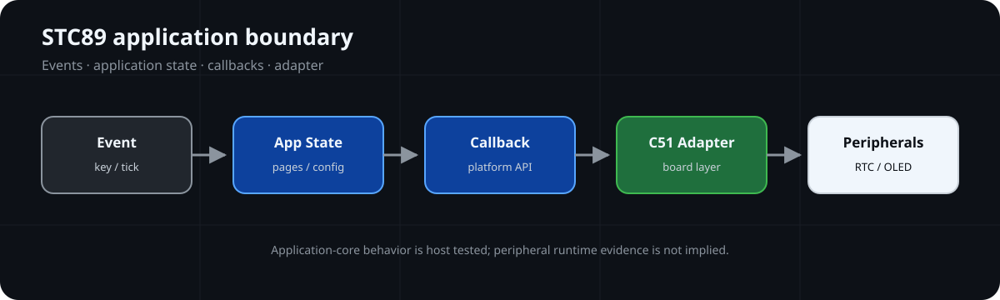
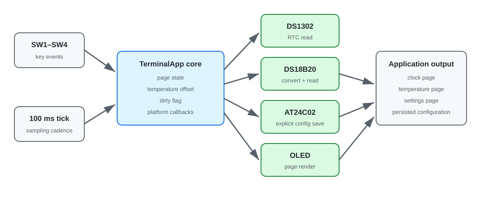

# stc89c52-learning

围绕 STC89C52RC 教学板的软件结构、外设连接与系统集成实践。

**🧠 Application State Machine**



## Application Snapshot

| Application Focus | Current Scope |
| --- | --- |
| MCU Context | STC89C52RC / 8051，典型主频 11.0592 MHz |
| Application Core | 页面状态、事件处理、周期采样与配置管理 |
| Persistence | 配置加载、脏标记与显式保存；C51 写后读回仅能核对读回值 |
| Platform Boundary | `TerminalPlatform` 回调与 C51 Adapter |
| Evidence | GCC 主机测试通过；Keil 整体构建与硬件验证未执行 |

> 💾 **Evidence:** Application state machine host-tested · GCC build passed · Peripheral hardware validation not performed

## 📌 Overview

当前代表项目“环境与时钟信息终端”把 RTC、温度、OLED、按键和非易失配置组织为可测试的应用核心，并把板级适配限制在清晰的平台边界内。

外设范围包括 DS1302、DS18B20、OLED、AT24C02、独立按键与 UART。

## 🏗️ Architecture



`terminal_app.c` 只管理页面、事件、周期采样和配置状态；`TerminalPlatform` 回调连接 RTC、温度、显示与 EEPROM。这样可以在主机端验证应用状态机，同时让 C51 入口只承担引脚和外设适配。

## ✨ Key Features

- 时钟、温度和设置三个页面的状态管理。
- NEXT / PREVIOUS / ADJUST / SAVE 四类按键事件。
- 每秒一次的 RTC 与温度采样节拍。
- 温度显示偏移范围管理与显式保存；保存失败保留脏标记。
- 配置脏标记，避免主循环重复写入 EEPROM。
- RTC 与温度采样使用临时值提交，区分上次有效值与本次采样结果。
- DS18B20 转换等待和 RTC 启动读取策略说明。

## 📂 Project Structure

```text
projects/13_环境与时钟信息终端/
  practice/core/terminal_app.c         可移植应用核心
  practice/include/terminal_app.h      平台接口与状态类型
  practice/c51/                        C51 板级适配入口
  practice/tests/test_terminal_app.c   主机端状态与失败路径测试
  docs/系统结构与数据流.md              设计说明
scripts/run_host_tests.py              GCC/Clang 主机测试入口
docs/                                   环境、架构、调试与硬件理解
hardware/                               接线与引脚说明
```

## 📚 Documentation

- [环境与时钟信息终端](projects/13_环境与时钟信息终端/README.md)
- [系统结构与数据流](projects/13_环境与时钟信息终端/docs/系统结构与数据流.md)
- [开发环境](docs/开发环境.md)
- [编译与烧录](docs/编译与烧录.md)
- [引脚映射](hardware/引脚映射.md)
- [调试记录](docs/调试记录.md)

## 🧪 Verification

### 💻 Host Test

从仓库根目录运行 `python scripts/run_host_tests.py --compiler gcc`。测试覆盖配置加载、页面切换、偏移调整、周期采样，以及 RTC/温度读取和保存失败后的状态与恢复。主机 Fake 的保存成功不代表 EEPROM 物理写入可靠。

### 🔨 Build Verification

可移植应用核心使用 C11 与严格警告选项构建；`.github/workflows/host-tests.yml` 对 GCC、Clang 及 sanitizer 运行同一套主机测试。该工作流不构建 C51 板级适配代码。

### 🔌 Hardware Validation

**Status:** Not Performed. 当前公开验证不包含 Keil 整体构建、串口烧录或实机运行；C51 Adapter 目录只表达板级适配关系。

### 📊 Runtime Evidence

现有运行证据仅限应用核心的主机状态测试，不代表 RTC、温度、OLED、EEPROM 或其他外设的板端运行结果。外部 C51 驱动不在当前公开仓库中：RTC 的范围检查无法发现所有静默驱动错误，温度适配没有底层失败反馈，EEPROM 写后读回也不能证明断电持久性。硬件检查项在项目文档中单独列出。

## License Boundary

根目录 [MIT License](LICENSE) 适用于仓库维护者编写的代码、文档与 SVG 图示。芯片/器件资料、开发工具、板卡图纸以及未随仓库分发的外部驱动保留各自的许可与权利边界。
