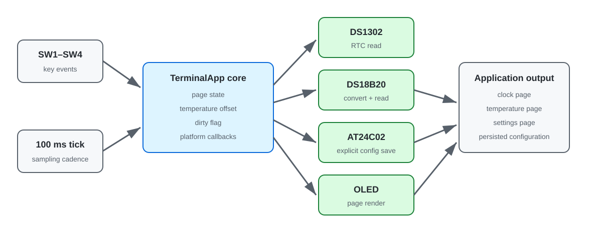

# 环境与时钟信息终端

## 功能与定位

这个个人综合实践把 DS1302、DS18B20、OLED、独立按键和 AT24C02 接口组织成一个应用。应用层负责页面、按键事件、刷新节拍和配置状态；C51 适配层连接已有器件驱动。

应用包含：

- 时钟、温度和设置三个页面的状态管理。
- SW1/SW2切换页面，SW3调整温度显示偏移，SW4保存配置。
- EEPROM保存当前页面与温度偏移。
- DS1302启动时只读取时间，不在每次复位时写入固定日期。
- DS18B20个人接口在`0x44`后等待转换完成，再读取暂存器。
- 应用核心在Windows GCC下使用模拟平台完成状态、页面和保存路径测试。

## 模块关系



```text
main.c
  ├─ 读取独立按键 → TerminalKey
  ├─ 每100 ms调用 terminal_app_tick()
  └─ TerminalPlatform 回调
       ├─ DS1302：读取RTC
       ├─ DS18B20：读取温度
       ├─ OLED：按页面显示
       └─ AT24C02：读写配置

terminal_app.c
  ├─ 页面状态
  ├─ 按键事件
  ├─ 采样/刷新节拍
  └─ 配置脏标记
```

`practice/core/`不包含寄存器和板级头文件，可以在主机端测试。`practice/c51/`是板级适配入口，复用仓库中以下课程接口：

- `projects/12_DS1302/.../Int_DS1302`、`Int_OLED`、`Dri_IIC`、`Dri_1Wire`和`Com_Util`。
- `projects/09_I2C与AT24C02/.../Int_EEPROM`。
- `projects/03_按键/.../Int_Key`。

新增的 `Int_DS18B20_Safe` 位于本项目中，负责 DS18B20 转换等待；其余适配接口调用对应课程工程中的驱动。

更完整的模块职责、事件状态和存储策略见[系统结构与数据流](docs/系统结构与数据流.md)。

## 数据流

1. 主循环把四个物理键转换为与硬件无关的事件。
2. 应用层改变页面或设置值，并记录配置是否需要保存。
3. 每10个100 ms tick读取一次RTC和温度。
4. 显示回调根据当前页面格式化输出，应用层不直接操作I²C。
5. 只有收到保存事件时才写EEPROM，避免每次循环写入非易失存储器。

## Timer与资源安排

C51 入口使用 100 ms 前台节拍组织多模块数据流，不占用 Timer0。DS1302 独立走时；DS18B20 读取等待转换完成。非阻塞版本可由 Timer0 产生系统 tick，再把温度转换拆成“启动”和“稍后读取”两个状态。

## 主机端验证

```powershell
gcc -std=c11 -Wall -Wextra -Werror -pedantic `
  practice/core/terminal_app.c practice/tests/test_terminal_app.c `
  -I practice/include -o terminal-app-test.exe
./terminal-app-test.exe
```

测试覆盖配置读取、周期采样、页面切换、偏移调整和显式保存。C51 适配代码已核对函数与文件依赖；Keil C51 构建和板端运行按下方清单记录。

## 实机验证清单

- 上电后RTC继续走时，没有被默认时间覆盖。
- OLED三个页面切换后无残留字符。
- DS18B20与参考温度对照，并记录转换周期。
- 调整偏移后断电重启，EEPROM配置仍能恢复。
- 连续按键时检查消抖、页面边界和I²C总线稳定性。
